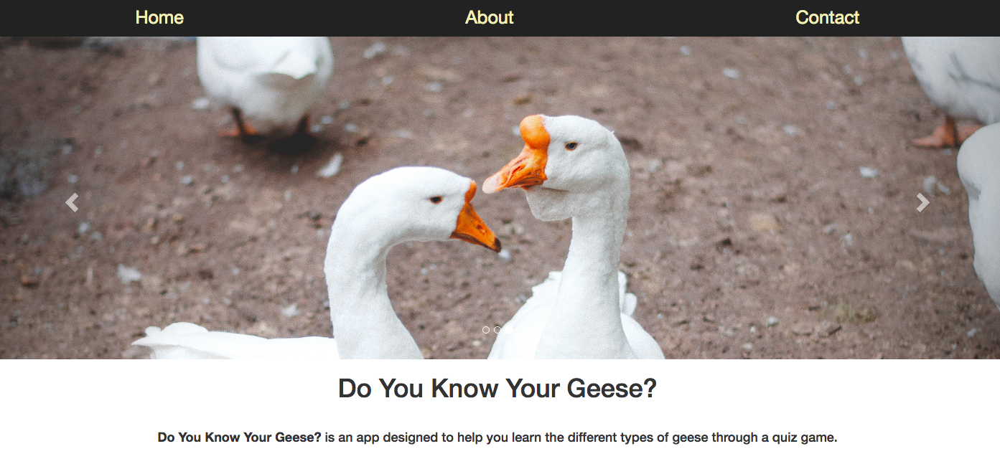

# Do You Know Your Geese?

View the website here:

[https://bnewing.github.io/Do-You-Know-Your-Geese/](https://bnewing.github.io/Do-You-Know-Your-Geese/)

## 1. What the Project Currently Is

So far, this is a website for a web app that I'm going to build. Once the web app is written, it will live on the website. It has a basic Home Page, an About Page and a Contact Page with a working contact form. I wrote the basic site in around a day.

## 2. What the Finished Project Will Be

I am planning on making a flash-card style web app with JavaScript that will have the following functionality:

- You're shown an image of a goose and options on what type of goose it is
- You select what type of goose you think it is
- You're told if you were right/what the right answer is
- If you click the 'next' button, you'll be taken to a new image

I'm also planning on adding in a page that shows different images and/or gifs of geese. I'm planning on using the Giphy API with this at some point. 

## 3. Technologies Used

- HTML
- CSS
- [Bootstrap](http://getbootstrap.com/)
- [Firebase](https://firebase.google.com/)

## 4. How to Suggest a Change

You can either raise an issue in the tab, or create a pull request to address the issue! To fork the repo and make a pull request, follow the steps listed here:

[https://help.github.com/articles/creating-a-pull-request-from-a-fork/](https://help.github.com/articles/creating-a-pull-request-from-a-fork/) 

## 5. What the Project Looks Like

